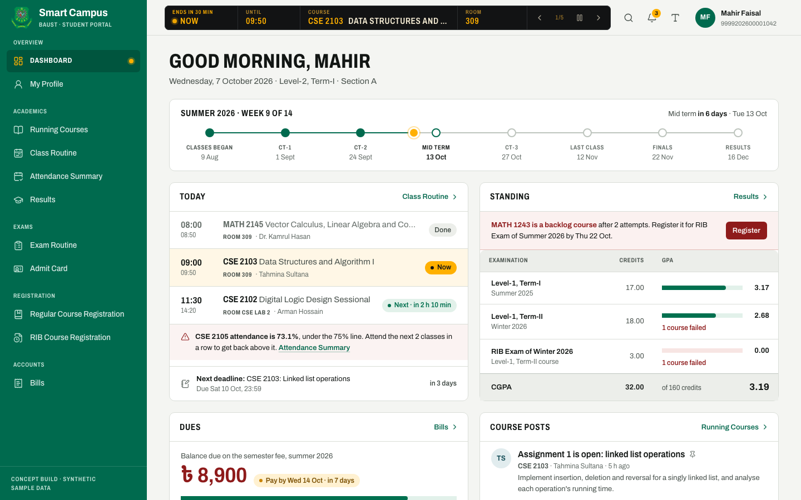
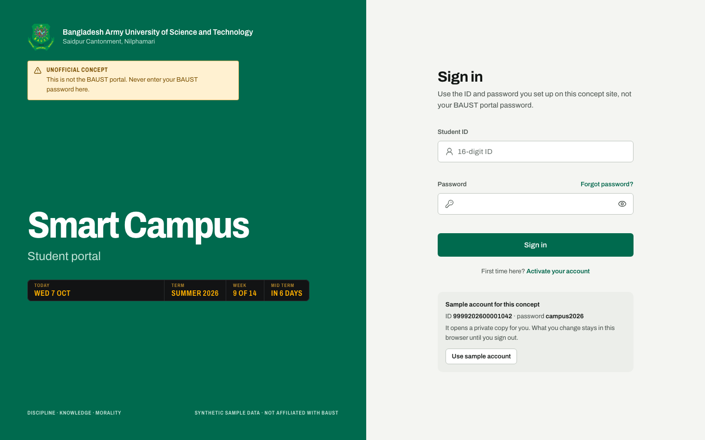
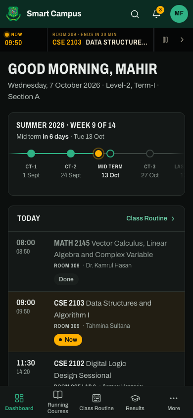

# Smart Campus — concept redesign

A from-scratch redesign of BAUST's **Smart Campus** student portal, backed by Firebase. Every person, ID, phone number, mark and amount in it is **synthetic sample data**; nothing comes from a real student record.

> **Unofficial.** This is a personal concept, not BAUST's portal, and it isn't affiliated with or endorsed by Bangladesh Army University of Science and Technology. Never enter your real BAUST password on it.

**Live:** https://smart-campus-baust.web.app



<p>
  
  
</p>

## Try it

- **Sample account** (shown on the sign-in page): ID `9999202600001042`, password `campus2026`. On the live site this opens a private copy of the sample student for you. What you change stays in your browser until you sign out.
- **Your own account:** choose *Activate your account*, then enter any 16-digit ID, a name and a password. You don't need your real student ID. Your RIB registration, demo payments, course comments and read notifications are saved to your account and come back on any device.

To demo a specific moment (for example a class in progress), pin the clock with a query string on any URL: `/?now=2026-10-05T10:20`. The academic calendar is anchored to "today", so the current term is always in its ninth week.

## Run it

```bash
npm install
npm run dev          # http://localhost:5173
```

With no Firebase config the portal runs **offline on sample data only**: just the sample login, and a reload restores the seed. Add a config (below) to get accounts.

```bash
npm run build && npm run preview   # production build on http://localhost:4173
```

## Firebase

| Service | What it does here |
| --- | --- |
| Authentication | Email/password accounts keyed by student ID, plus anonymous sign-in for the sample sandbox |
| Cloud Firestore (`asia-south1`) | Each student's own records, private to them |
| Hosting | The built app, with long-lived caching for hashed files and none for pages |
| Analytics | Page views, plus `login`, `sign_up`, `rib_register` and `demo_payment` events, in production builds once a measurement ID is set |

**Student IDs as accounts.** A student signs in with a 16-digit ID, never an email address. Behind the scenes the ID becomes an internal address, `<id>@students.smart-campus.example`. Nothing is ever sent to it, which is also why there are no password-reset emails.

**Data model.** Everything sits under the student's own document:

```
students/{uid}                    profile: studentId, name, kind ("activated" | "demo")
students/{uid}/payments/{id}      demo payments
students/{uid}/bills/{id}         bills the student's actions created (RIB fees)
students/{uid}/notices/{id}       notifications those actions produced
students/{uid}/comments/{id}      course discussion comments (postId says where)
students/{uid}/state/rib          RIB registration for the open exam
students/{uid}/state/notices      ids of notifications the student has read
```

The courses, routine, marks and the rest are the shared synthetic seed in `src/data/seed.ts`. A student's saved records are merged over it at sign-in (`src/api/cloud.ts`, `src/api/store.ts`). Comments are deliberately private: on a public demo with open sign-up, a shared board would show strangers' posts to every visitor.

**Security rules** (`firestore.rules`):

- A student can read and write only their own records.
- Every collection accepts exactly the fields the portal writes, with sensible sizes and types.
- Payments, notifications and comments can't be edited after they're written, and nothing can be deleted.
- An activated profile's ID must match the account it belongs to. The sample sandbox can only ever be the sample student.

### Configure

```bash
cp .env.example .env.local
npx firebase apps:sdkconfig WEB <app-id> --project <project-id>   # copy the values into .env.local
```

The web config isn't a secret: it ships inside every Firebase web app's JavaScript. Access is controlled by the security rules.

### Local emulators

Test against local Auth and Firestore emulators (Java 11+ required); nothing reaches a real project:

```bash
npm run emulators        # Auth :9099, Firestore :8080, Emulator UI http://localhost:4000
npm run dev:emulated     # the portal, wired to the emulators (.env.emulators)
```

### Deploy

```bash
npx firebase login
npm run deploy           # build, then deploy hosting, Firestore rules and the sign-in providers
```

### Analytics

Analytics runs only in production builds served from a real domain: never in `npm run dev`, against the emulators, or on `localhost`. To switch it on for your own Firebase project:

1. Enable Google Analytics in the Firebase console (Project settings → Integrations).
2. Run `npx firebase apps:sdkconfig WEB <app-id>` and copy `measurementId` into `.env.local` as `VITE_FIREBASE_MEASUREMENT_ID`.
3. Run `npm run deploy`.

Page views come from GA4's enhanced measurement, which follows in-app navigation on its own.

## Stack

| Concern | Choice | Why |
| --- | --- | --- |
| App | Vite + React 19 + TypeScript (strict) | The whole product sits behind a login, so a client-rendered SPA with route-level code splitting is the right weight; no SSR or SEO needs. |
| Routing | React Router 8 (data router, lazy routes) | Nested routes for the course space and its tabs. |
| Data | TanStack Query over an in-memory store, written through to Firestore | Real loading, empty and error states; the store answers instantly and Firestore keeps what the student did. |
| Backend | Firebase Auth, Firestore Lite, Hosting, Analytics (lazy-loaded) | Accounts and per-student persistence without running a server. Firestore Lite keeps the bundle small and leaves nothing cached on shared computers. |
| Styling | Tailwind CSS v4 over CSS custom-property tokens | One token layer drives light, dark and three text sizes. |
| Primitives | Radix UI | Accessible dialogs, menus, selects, tabs, checkboxes and radios. |
| Motion | GSAP (ScrambleText, Flip) + transitions.dev CSS recipes | GSAP for the departure board's character roll and list reordering; the recipes for every menu, dialog, tab, tooltip, toast, accordion, skeleton and loading line. All of it respects reduced motion. |
| Icons / type | Lucide; Archivo (variable width) self-hosted, plus a 1 KB subset for the ৳ sign | |

## Where things are

- `src/data/seed.ts` — the synthetic dataset (student, courses, routine, attendance, marks, posts, results, bills, exams).
- `src/api/` — the in-memory store, the Firestore layer (`cloud.ts`), derived selectors (attendance outlook, ledger, CGPA, the departure board's items) and query hooks.
- `src/app/auth.tsx` — sign-in in both modes (Firebase accounts, or the offline sample login).
- `src/lib/firebase.ts` — Firebase setup; everything is optional and switches off without config.
- `src/shell/` — app shell, rail, the departure board, phone header and tab bar, search (Ctrl/⌘ K), notifications, display settings.
- `src/pages/` — every module. Module names are unchanged from the original portal.
- `src/styles/` — tokens, the board, components, and the motion recipes.
- `firebase.json`, `firestore.rules`, `.env.example`, `.env.emulators` — Firebase configuration.
- `PRODUCT.md` — product record. `DESIGN.md` — the design system.

## Demo-only behaviour

Payments are simulated: no money moves and no provider is contacted. File downloads and assignment submission are simulated too. The 75% attendance line and the CGPA rule are illustrative, not BAUST policy.

## License

The code is released under the [MIT License](LICENSE). BAUST's name and crest belong to Bangladesh Army University of Science and Technology and aren't covered by it; they appear only so the concept is recognisable.
